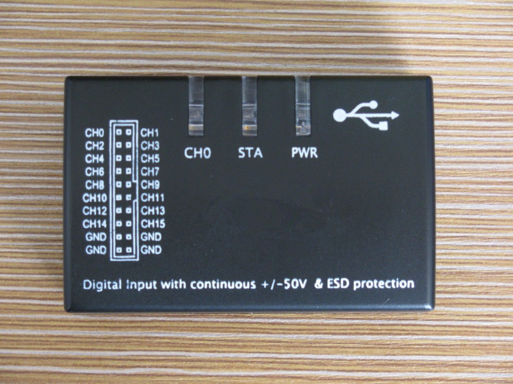

# Logic 16 adapter.
This adapter converts levels and protects inputs for Saleae Logic 16 clone adapter.

The problem with Logic 16 clone adapter is that it loads the analyzed sirquits and have pour over voltage protection. Using it with signals more than 5 volt can lead to damage and mistakes in measurements.

With this adapter you can set different channels to different signal levels by choosing input resistors.

Logoc 16 adapter for Saleae Logic 16 clone:

TOP view:

BOTTOM view:

Saleae Logic 16 clone from aliexpress:

You can find analog analyzers and modify this progect for different hardware here: https://sigrok.org/wiki/Mcupro_Logic16_clone

## Licenses

### Circuit Schematics

The circuit schematics of this project are made available under the
[CC-BY-SA](https://creativecommons.org/licenses/by-sa/3.0/) license.

### Hardware Design

 Open source hardware.

### Miscellenious

Data sheets, Altium libraries, 3D Models are subject to vendor specific
licensing.

